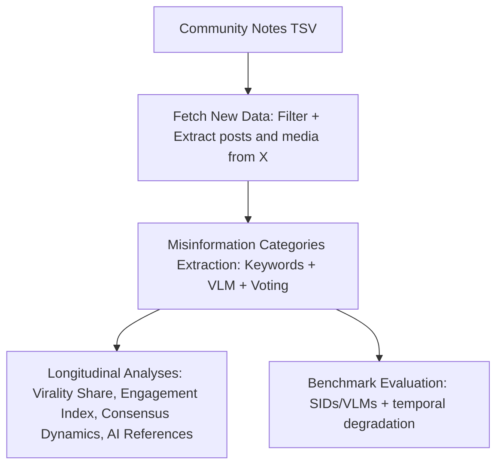

# CONVEX Dataset & Code

This repository accompanies **“The Synthetic Media Shift: Tracking the Rise, Virality, and Detectability of AI-Generated Multimodal Misinformation”** and provides code + processed artifacts for analysis and benchmarking.

[Paper](https://arxiv.org/abs/2604.15372) | [Supplementary](supplementary_material/) | [Citation (TBD)](#citation)

## Pipeline (high level)

## Abstract

As generative AI advances, the distinction between authentic and synthetic media is increasingly blurred, challenging information integrity. In this study, we present CONVEX, a large-scale dataset of multimodal misinformation involving miscaptioned, edited, and AI-generated visual content, comprising over 150K multimodal posts with associated notes and engagement metrics from X's Community Notes. We analyze how multimodal misinformation evolves in terms of virality, engagement, and consensus dynamics, with a focus on synthetic media. Our results show that while AI-generated content achieves disproportionate virality, its spread is driven primarily by passive engagement rather than active discourse. Despite slower initial reporting, AI-generated content reaches community consensus more quickly once flagged. Moreover, our evaluation of specialized detectors and vision-language models reveals a consistent decline in performance over time in distinguishing synthetic from authentic images as generative models evolve. These findings highlight the need for continuous monitoring and adaptive strategies in rapidly evolving information environments.

## Quick Start

1. Read `src/README.md` for the repository map.
2. For dataset renewal: `src/renew_data/README.md`
3. For labeling: `src/misinformation/README.md`
4. For benchmark evaluation: `src/benchmark_evaluation/README.md`

## Data / Privacy Note

To reduce risk and comply with platform and privacy constraints, this repository **does not include sensitive or X-extracted content**. Some tweet-level fields may appear in anonymized or non-content form (e.g., engagement counts). Any additional tweet-level content or media should be reconstructed from public Community Notes downloads (or requested from the authors), subject to applicable policies.

## Citation

TBD
